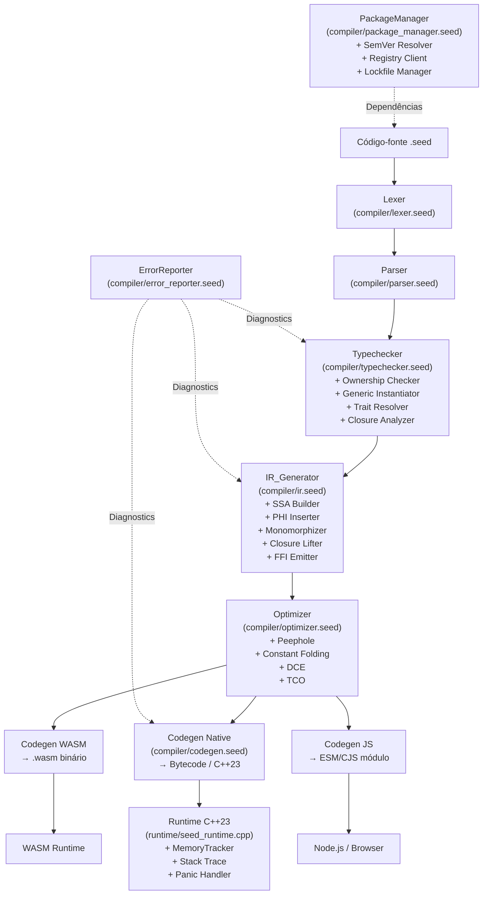
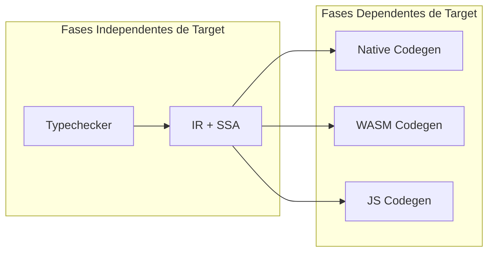
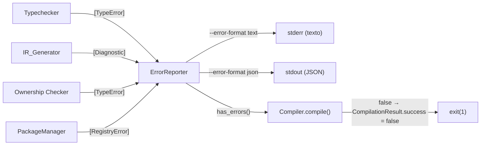

# Design Técnico — SEED Advanced Features

## Visão Geral

Este documento descreve o design técnico para as features avançadas da linguagem SEED versão `0.4`, cobrindo cinco domínios principais: IR completo com SSA, sistema de tipos avançado (Union types, Generics, Traits, Type Constraints), Closures com captura de variáveis, modelo de memória por Ownership, Package Manager com lockfile/SemVer/Registry, FFI para WASM e JavaScript, Stack Traces abrangentes e sistema de erros com diagnósticos detalhados.

A base sobre a qual este design é construído é o dialeto `0.3-result-match`, que já inclui:
- Parser com suporte a `match`, `data`, `trait`, `impl`, `where`, generics
- Typechecker com inferência Hindley-Milner parcial e suporte a `Union`/`TypeVar`
- IR básico com opcodes `OP_ALLOC`, `OP_FREE`, `OP_MAKE_CLOSURE`, `OP_CAPTURE`
- Runtime C++23 com sete primitivas: `ALLOC`, `FREE`, `READ`, `WRITE`, `CMP`, `JMP`, `SYSCALL`
- Codegen que produz bytecode para a VM SEED

O design desta versão `0.4` estende cada componente existente sem quebrar compatibilidade com o dialeto `0.3`.

---

## Arquitetura

### Pipeline de Compilação



### Fluxo de Compilação com Targets



### Novos Módulos SEED 0.4

| Módulo | Arquivo | Responsabilidade |
|--------|---------|------------------|
| `compiler.error_reporter` | `compiler/error_reporter.seed` | Formatação e emissão de Diagnostics |
| `compiler.ownership` | `compiler/ownership.seed` | Verificação de Ownership, Move e Borrow |
| `compiler.memory_tracker` | `compiler/memory_tracker.seed` | Rastreamento de alocações em modo debug |
| `compiler.package_manager` | `compiler/package_manager.seed` | Resolução de dependências, lockfile, SemVer |
| `compiler.registry_client` | `compiler/registry_client.seed` | Comunicação com o Registry de pacotes |
| `compiler.wasm_codegen` | `compiler/wasm_codegen.seed` | Backend de geração de WASM binário |
| `compiler.js_codegen` | `compiler/js_codegen.seed` | Backend de geração de JavaScript |
| `compiler.ffi` | `compiler/ffi.seed` | Resolução e verificação de declarações FFI |
| `compiler.stack_trace` | `compiler/stack_trace.seed` | Coleta e formatação de stack traces |

---

## Componentes e Interfaces

### 1. IR_Generator Estendido (Requisito 1)

O `IR_Generator` existente em `compiler/ir.seed` é estendido com os seguintes opcodes e mecanismos:

**Novos Opcodes IR:**
```seed
const OP_UNION_TAG    = IROpcode { name: "union_tag",    kind: "union" }
const OP_UNION_ACCESS = IROpcode { name: "union_access", kind: "union" }
const OP_PHI          = IROpcode { name: "phi",          kind: "ssa"   }  // já existe
const OP_MAKE_CLOSURE = IROpcode { name: "make_closure", kind: "closure" } // já existe
const OP_CAPTURE      = IROpcode { name: "capture",      kind: "closure" } // já existe
```

**Interface do SSA Builder:**
```seed
type SSABuilder = {
    dominators: dict          // bloco -> conjunto de dominadores
    dom_frontier: dict         // bloco -> fronteira de dominância
    phi_nodes: dict            // bloco -> [IRValue que precisam de PHI]
    defs: dict                 // IRValue.data -> [bloco onde é definido]
}

fn build_ssa(ctx: IRContext, func: IRFunction) -> IRFunction
fn insert_phi_nodes(builder: SSABuilder, func: IRFunction) -> IRFunction
fn rename_values(builder: SSABuilder, func: IRFunction) -> IRFunction
fn compute_dominators(func: IRFunction) -> dict
fn compute_dom_frontier(func: IRFunction, dominators: dict) -> dict
```

**Interface da Monomorphization:**
```seed
type MonomorphizationCache = {
    instances: dict   // "nome__T1__T2" -> IRFunction
}

fn monomorphize(ctx: IRContext, generic_func: IRFunction, type_args: [Type]) -> IRFunction
fn mangle_name(base_name: string, type_args: [Type]) -> string
fn substitute_type_vars(func: IRFunction, type_map: dict) -> IRFunction
```

**Serialização do IRModule:**
```seed
fn serialize_ir_module(module: IRModule) -> string   // JSON compacto
fn deserialize_ir_module(data: string) -> IRModule
fn ir_modules_equivalent(a: IRModule, b: IRModule) -> bool
```

### 2. Typechecker Estendido (Requisitos 2–7)

O `Typechecker` em `compiler/typechecker.seed` recebe quatro extensões ortogonais:

**2a. Verificação de Exhaustividade de Union:**
```seed
fn check_match_exhaustiveness(env: TypeEnv, match_node: ASTNode, union_type: Type) -> [TypeError]
fn missing_variants(union_type: Type, covered_patterns: [ASTNode]) -> [Type]
fn detect_circular_union(name: string, definition: Type, env: TypeEnv) -> bool
```

**2b. Generic Instantiator (Hindley-Milner):**
```seed
type Substitution = dict   // TypeVar.name -> Type

fn unify_hm(t1: Type, t2: Type, subst: Substitution) -> Option[Substitution]
fn apply_substitution(t: Type, subst: Substitution) -> Type
fn generalize(t: Type, env: TypeEnv) -> Type
fn instantiate(scheme: TypeScheme, env: TypeEnv) -> Type

type TypeScheme = {
    quantifiers: [string]
    body: Type
}
```

**2c. Trait Resolver:**
```seed
type TraitRegistry = {
    traits: dict        // nome -> TraitDef
    impls: dict         // "TraitNome::TipoNome" -> ImplDef
}

type TraitDef = {
    name: string
    type_params: [string]
    methods: dict       // nome -> assinatura
    bounds: [Type]      // supertraits
}

type ImplDef = {
    trait_name: string
    type_name: string
    methods: dict       // nome -> IRFunction
    vtable: IRConstant
}

fn resolve_trait(env: TypeEnv, registry: TraitRegistry, trait_name: string, type_name: string) -> Option[ImplDef]
fn check_impl_completeness(trait_def: TraitDef, impl_node: ASTNode) -> [string]   // métodos ausentes
fn build_vtable(trait_def: TraitDef, impl_def: ImplDef) -> IRConstant
fn check_where_clauses(constraints: [TypeConstraint], type_args: [Type], registry: TraitRegistry) -> [TypeError]
```

**2d. Ownership Checker (módulo separado `compiler/ownership.seed`):**
```seed
type OwnershipEnv = {
    owners: dict        // nome -> OwnershipState
    borrows: dict       // nome -> [BorrowInfo]
    scope_stack: [Scope]
}

type OwnershipState = {
    kind: string        // "owned" | "moved" | "borrowed" | "mut_borrowed"
    location: Location
}

type BorrowInfo = {
    kind: string        // "shared" | "exclusive"
    scope_depth: int
    location: Location
}

fn check_ownership(node: ASTNode, env: OwnershipEnv) -> [TypeError]
fn transfer_ownership(env: OwnershipEnv, from: string, to: string)
fn check_borrow_conflicts(env: OwnershipEnv, location: Location) -> Option[TypeError]
fn emit_free_on_scope_exit(env: OwnershipEnv, ctx: IRContext, scope: Scope)
```

### 3. Closure Lifter (Requisito 6)

Integrado ao IR_Generator:

```seed
type ClosureAnalysis = {
    free_vars: [string]         // upvalues identificados
    capture_by_ref: [string]    // variáveis capturadas por referência
    capture_by_value: [string]  // variáveis capturadas por valor
}

fn analyze_closure(node: ASTNode, outer_scope: TypeEnv) -> ClosureAnalysis
fn lift_closure(ctx: IRContext, node: ASTNode, analysis: ClosureAnalysis) -> (IRFunction, IRValue)
fn emit_capture_record(ctx: IRContext, analysis: ClosureAnalysis) -> IRValue
```

### 4. MemoryTracker (Requisito 8)

Módulo `compiler/memory_tracker.seed` — instrumentação injetada pelo Codegen em modo `--debug`:

```seed
type AllocationEntry = {
    ptr: int
    size: int
    file: string
    line: int
    column: int
    timestamp: int
}

type MemoryTrackerState = {
    active_allocations: dict    // ptr -> AllocationEntry
    total_allocated: int
    total_freed: int
}

// Funções injetadas no output em modo --debug:
fn __mt_alloc(ptr: int, size: int, file: string, line: int, col: int)
fn __mt_free(ptr: int)
fn __mt_report() -> int   // retorna número de leaks
```

### 5. PackageManager (Requisitos 9–11)

Módulo `compiler/package_manager.seed`:

```seed
type SeedFile = {
    name: string
    version: string
    dependencies: dict          // nome -> VersionConstraint
}

type VersionConstraint = {
    kind: string                // "exact" | "tilde" | "caret" | "range"
    raw: string
    min: SemVer
    max: SemVer
    include_prerelease: bool
}

type SemVer = {
    major: int
    minor: int
    patch: int
    pre: string
    build: string
}

type LockEntry = {
    name: string
    version: SemVer
    sha256: string
    url: string
}

type Lockfile = {
    entries: dict               // nome -> LockEntry
    generated_at: string
}

fn parse_semver(s: string) -> Result[SemVer, string]
fn semver_matches(constraint: VersionConstraint, v: SemVer) -> bool
fn resolve_dependencies(seedfile: SeedFile, registry: RegistryIndex) -> Result[Lockfile, [string]]
fn write_lockfile(lockfile: Lockfile, path: string) -> Result[Unit, string]
fn read_lockfile(path: string) -> Result[Lockfile, string]
fn verify_sha256(data: [byte], expected: string) -> bool
```

**Registry Client:**
```seed
type RegistryClient = {
    base_url: string
    credentials_path: string
    max_retries: int            // default: 3
}

fn publish(client: RegistryClient, pkg_path: string) -> Result[Unit, RegistryError]
fn search(client: RegistryClient, term: string) -> Result[[PackageInfo], RegistryError]
fn download(client: RegistryClient, name: string, version: SemVer, lockfile: Lockfile) -> Result[[byte], RegistryError]

type RegistryError = {
    kind: string    // "network" | "auth" | "conflict" | "invalid_response" | "not_found"
    message: string
    diagnostic: Diagnostic
}
```

### 6. FFI WASM e JS (Requisitos 12–13)

**Módulo `compiler/ffi.seed`:**
```seed
type FFIDecl = {
    kind: string        // "wasm" | "js"
    module_path: string
    fn_name: string
    seed_name: string
    params: [Type]
    return_type: Type
}

// Mapeamento de tipos SEED <-> WASM
const WASM_TYPE_MAP = dict([
    ("Int",   "i32"),
    ("Float", "f64"),
    ("Bool",  "i32"),
])

// Tipos não-mapeáveis para WASM: String, closures, structs complexos → SEED020

// Mapeamento de tipos SEED <-> JS
const JS_TYPE_MAP = dict([
    ("Int",    "number"),
    ("Float",  "number"),
    ("String", "string"),
    ("Bool",   "boolean"),
    ("Unit",   "undefined"),
])

fn check_ffi_types(decl: FFIDecl, target: string) -> [TypeError]
fn emit_wasm_import(decl: FFIDecl, module: WasmModule)
fn emit_js_wrapper(decl: FFIDecl, output: JsModule)
fn emit_js_coercion(from_type: Type, to_type: string, ctx: CodegenContext) -> string
```

### 7. Stack Trace e Runtime (Requisito 14)

Extensão do runtime C++23 em `runtime/seed_runtime.cpp`:

```cpp
// seed_runtime.h — estruturas de debug
typedef struct {
    int    frame_index;
    char*  fn_name;
    char*  file_path;
    int    line;
    int    column;
    char*  frame_kind;   // "seed" | "ffi:wasm" | "ffi:js" | "closure"
} SeedFrame;

typedef struct {
    SeedFrame* frames;
    int        count;
    int        capacity;
} SeedCallStack;

void seed_push_frame(const char* fn_name, const char* file, int line, int col);
void seed_pop_frame(void);
void seed_panic(const char* message);
void seed_print_stack_trace(int max_frames);   // max_frames = 20
```

**Debug Map gerado pelo Codegen:**
```seed
type DebugMap = {
    entries: [DebugEntry]
}

type DebugEntry = {
    ir_instruction_id: int
    file: string
    line: int
    column: int
    fn_name: string
}

fn emit_debug_section(debug_map: DebugMap, output: CodegenOutput)
fn load_debug_section(data: [byte]) -> DebugMap
```

### 8. ErrorReporter (Requisito 15)

Módulo `compiler/error_reporter.seed`:

```seed
type Diagnostic = {
    code: string            // "SEEDXXX" ou "SEED_PKGXXX"
    severity: Severity
    location: Location
    message: string
    source_snippet: string
    suggestion: string
    related: [Diagnostic]
    diff: Option[string]    // diff unificado quando suggestion é substituição
}

type Severity = {
    level: string           // "error" | "warning" | "proposal"
}

type Location = {
    file: string
    line: int
    column: int
    end_line: int
    end_column: int
}

fn format_diagnostic(d: Diagnostic) -> string
fn format_diagnostics_json(diagnostics: [Diagnostic]) -> string
fn parse_diagnostic_json(json: string) -> Result[Diagnostic, string]
fn group_by_location(diagnostics: [Diagnostic]) -> [[Diagnostic]]
fn compute_diff(original: string, suggestion: string) -> string
fn underline_source(snippet: string, location: Location) -> string
```

---

## Modelos de Dados

### IRInstruction Estendida

```seed
type IRInstruction = {
    id: int
    opcode: IROpcode
    operands: [IROperand]
    result: Option[IRValue]
    line: int
    column: int
    // Campos novos em 0.4:
    ffi_wasm: bool          // para OP_CALL de extern wasm
    ffi_js: bool            // para OP_CALL de extern js
    debug_name: string      // nome legível para disassembly
}
```

### Type Estendido

```seed
type Type = {
    kind: string    // "Int"|"Float"|"String"|"Bool"|"Null"|"Unit"|"Any"|
                    // "TypeVar"|"Function"|"Array"|"Union"|"Named"|
                    // "Generic"|"Trait"|"Ref"|"RefMut"   // novos em 0.4
    name: string
    params: [Type]
    // Campos novos:
    is_owned: bool  // para o ownership checker
    trait_bounds: [string]  // para type params com bounds
}
```

### GenericContext Estendido

```seed
type GenericContext = {
    type_params: [string]
    constraints: [TypeConstraint]
    // Campos novos:
    instantiations: dict    // type_param_name -> Type (durante inferência)
}
```

### SemVer e Lockfile

```seed
// Estrutura canônica do seed.lock (formato JSON)
{
    "version": "1",
    "generated_at": "2024-01-01T00:00:00Z",
    "entries": {
        "nome-pacote": {
            "version": "1.2.3",
            "sha256": "abc123...",
            "url": "https://registry.seed-lang.org/packages/nome-pacote/1.2.3.seed-pkg",
            "dependencies": {}
        }
    }
}
```

### Diagnostic (formato JSON)

```json
{
    "code": "SEED005",
    "severity": "error",
    "location": {
        "file": "src/main.seed",
        "line": 42,
        "column": 5,
        "end_line": 42,
        "end_column": 20
    },
    "message": "Match não-exaustivo: variante 'None' não tratada",
    "source_snippet": "    match valor {",
    "suggestion": "Adicione o braço 'None => ...'",
    "related": [],
    "diff": null
}
```

---

## Correctness Properties

*A property is a characteristic or behavior that should hold true across all valid executions of a system — essentially, a formal statement about what the system should do. Properties serve as the bridge between human-readable specifications and machine-verifiable correctness guarantees.*

### Property 1: Round-trip do IRModule (serialização)

*For any* IRModule `M` produzido a partir de uma AST válida, serializar `M` para JSON e desserializar o resultado SHALL produzir um IRModule estruturalmente equivalente a `M`.

**Validates: Requirements 1.9**

---

### Property 2: Propriedade SSA — definição única por IRValue

*For any* IRFunction `f` processada pelo IR_Generator, nenhum `IRValue.data` SHALL aparecer no campo `result` de mais de uma `IRInstruction` em qualquer execução do CFG (cada valor é definido exatamente uma vez).

**Validates: Requirements 1.2**

---

### Property 3: Union type — aceitação de membro e rejeição de não-membro

*For any* Union type `U = A | B`, atribuir um valor de tipo `T` a uma variável anotada como `U` SHALL ser aceito pelo Typechecker se e somente se `T ∈ {A, B, Any}`.

**Validates: Requirements 2.4, 2.5, 2.6**

---

### Property 4: Exhaustividade de match sobre Union

*For any* Union type `U` com variantes `{V1, ..., Vn}` e expressão `match` que cobre exatamente o subconjunto `S ⊆ {V1, ..., Vn}`, o Typechecker SHALL emitir o Diagnostic `SEED005` se e somente se `S ≠ {V1, ..., Vn}` (ou seja, quando existem variantes não cobertas).

**Validates: Requirements 2.2, 2.3**

---

### Property 5: Propriedade metamórfica de Union — inferência equivalente

*For any* Union type `U` e tipo membro `T`, verificar um valor de tipo `T` diretamente SHALL produzir o mesmo tipo de retorno que verificar o mesmo valor como `U` e depois verificar o braço correspondente no `match`.

**Validates: Requirements 2.8**

---

### Property 6: Identidade de tipo em funções genéricas

*For any* função genérica `f[T](x: T) -> T` e tipo concreto `A`, a instância `f[A]` SHALL ser aceita pelo Typechecker sem erro, e o resultado de `f[A](v)` SHALL ter tipo `A` para qualquer valor `v` de tipo `A`.

**Validates: Requirements 3.3, 3.7**

---

### Property 7: Monomorphization — deduplicação de instâncias

*For any* dois call sites que instanciam a mesma função genérica `f[T]` com os mesmos type arguments concretos `[A]`, o IRModule gerado SHALL conter exatamente uma função monomorfa com nome `f__A` (sem duplicação).

**Validates: Requirements 3.6**

---

### Property 8: Completude da vtable de Trait

*For any* Trait `T` com `N` métodos declarados e `impl T for C` completo, a vtable gerada pelo IR_Generator SHALL conter exatamente `N` ponteiros de função, um para cada método declarado no Trait.

**Validates: Requirements 4.8**

---

### Property 9: Completude do capture record de Closure

*For any* closure `c` que captura as variáveis `{v1, ..., vn}` identificadas pelo Typechecker, o capture record emitido pelo IR_Generator SHALL conter referências a exatamente `n` upvalues — nem mais nem menos.

**Validates: Requirements 6.7**

---

### Property 10: Verificação de constraints WHERE com múltiplos traits

*For any* função genérica com `where T: TraitA + TraitB` instanciada com um tipo `C`, o Typechecker SHALL emitir erro se e somente se `C` não implementa pelo menos um dos traits (TraitA ou TraitB).

**Validates: Requirements 5.7**

---

### Property 11: Invariante de balanço ALLOC/FREE no IR

*For any* IRModule gerado com o modelo de Ownership ativado, para todo `OP_ALLOC` com id `N` no CFG, SHALL existir exatamente um `OP_FREE` que referencia `N` em algum bloco alcançável do CFG.

**Validates: Requirements 7.2, 7.7**

---

### Property 12: Invariante de balanço do MemoryTracker

*For any* programa com `N` alocações e `N` frees correspondentes executado sob o MemoryTracker, a tabela de alocações ativas SHALL conter zero entradas ao término normal da execução.

**Validates: Requirements 8.7**

---

### Property 13: Reprodutibilidade do lockfile (seed install)

*For any* `seed.lock` fixo, executar `seed install` múltiplas vezes em máquinas distintas SHALL produzir diretórios de dependências com conteúdo bit-a-bit idêntico.

**Validates: Requirements 9.6**

---

### Property 14: Corretude do matcher SemVer

*For any* constraint `C` e versão `V`, `semver_matches(C, V)` SHALL retornar `true` se e somente se `V` satisfaz `C` segundo a especificação SemVer 2.0.0.

**Validates: Requirements 10.5**

---

### Property 15: Ordenação do stack trace (ordem inversa de chamada)

*For any* cadeia de chamadas `A → B → ... → Z` onde `Z` entra em pânico, o stack trace gerado pelo Runtime SHALL listar os frames na ordem `Z, ..., B, A` (frame mais recente primeiro, frame mais antigo por último).

**Validates: Requirements 14.7**

---

### Property 16: Round-trip de Diagnostic (serialização JSON)

*For any* Diagnostic `D` emitido pelo Compiler, serializar `D` para JSON e desserializar o resultado SHALL produzir um Diagnostic com campos e valores idênticos a `D`.

**Validates: Requirements 15.8**

---

### Property 17: Número correto de frames no stack trace

*For any* call stack de profundidade `d`, o stack trace exibido pelo Runtime em caso de pânico SHALL conter `min(d, 20)` frames.

**Validates: Requirements 14.1**

---

### Property 18: Diagnostic completo (campos obrigatórios)

*For any* Diagnostic emitido pelo ErrorReporter, a representação formatada SHALL conter todos os campos obrigatórios: código, severidade, localização (`arquivo:linha:coluna`), mensagem principal, trecho de código sublinhado e campo `suggestion`.

**Validates: Requirements 15.1**

---

## Error Handling

### Estratégia Geral de Erros

Todos os erros do compilador são representados como `Diagnostic` e roteados pelo `ErrorReporter`. Nenhum componente deve usar `panic` interno para erros recuperáveis.

### Mapeamento de Códigos de Erro

| Código | Componente | Condição |
|--------|-----------|----------|
| `SEED005` | Typechecker | Match não-exaustivo sobre Union |
| `SEED007` | Typechecker | Atribuição de tipo incompatível com Union |
| `SEED008` | Typechecker | Union type circular direto |
| `SEED010` | IR_Generator | ASTNode sem lowering definido |
| `SEED011` | Typechecker | Violação de Type Constraint (where clause ou generic) |
| `SEED012` | Typechecker | `impl` omite métodos do Trait |
| `SEED013` | Typechecker | Assinatura de método impl incompatível com Trait |
| `SEED014` | Typechecker | Dois `impl` do mesmo Trait para o mesmo tipo |
| `SEED015` | Typechecker | Where clause referencia Trait inexistente |
| `SEED016` | Typechecker | Closure modifica upvalue mutável de forma proibida pelo modelo de memória |
| `SEED017` | Ownership Checker | Uso de identificador após movimento (use-after-move) |
| `SEED018` | Ownership Checker | Dois empréstimos `ref mut` simultâneos |
| `SEED020` | Typechecker (FFI) | Tipo SEED não-mapeável para WASM |
| `SEED021` | Typechecker (FFI) | Tipo SEED sem mapeamento JS |
| `SEED_PKG001` | PackageManager | Incompatibilidade entre seedfile.seed e lockfile |
| `SEED_PKG002` | PackageManager | Hash SHA-256 diverge do lockfile |
| `SEED_PKG003` | PackageManager | Conflito de versões irresolvível |
| `SEED_PKG004` | PackageManager | String de versão não-SemVer |
| `SEED_PKG005` | Registry Client | Falha de rede após 3 tentativas |
| `SEED_PKG006` | Registry Client | Token ausente ou expirado |
| `SEED_PKG007` | Registry Client | Publicação de versão já existente (HTTP 409) |
| `SEED_PKG008` | Registry Client | Payload inválido do registry |

### Propagação de Erros no Pipeline



### Recuperação de Erros

- O Typechecker continua a análise após erros (erro não-fatal) para coletar todos os problemas de uma só vez.
- O IR_Generator emite `SEED010` e pula o nó AST problemático, continuando o lowering.
- O PackageManager interrompe a instalação em falha de hash (SEED_PKG002) — erro fatal para segurança.
- O MemoryTracker não interrompe a execução; apenas coleta e reporta ao final.

---

## Testing Strategy

### Abordagem Dual de Testes

Esta feature usa tanto testes baseados em exemplos quanto testes baseados em propriedades (PBT). Os dois são complementares: testes de exemplo verificam comportamentos concretos e casos de borda; PBT verifica propriedades universais com 100+ iterações de entradas aleatórias.

**Biblioteca PBT escolhida:** Para o runtime de testes das propriedades SEED, usa-se a biblioteca `fast-check` (JavaScript/TypeScript) nos testes que rodam nos CI pipelines, dado que o runtime SEED ainda está em bootstrap. Alternativamente, para testes escritos em SEED puro, usa-se uma biblioteca de PBT nativa a ser desenvolvida como parte de `stdlib/test.seed` — com geradores (`gen_string`, `gen_int`, `gen_list`, etc.) e função `property(name, gen, prop, iterations: 100)`.

**Configuração:** Cada property test deve rodar **mínimo 100 iterações**.

**Tag format:** `// Feature: seed-language-advanced-features, Property N: <texto da propriedade>`

---

### Testes Unitários (Exemplos e Casos de Borda)

**IR_Generator:**
- Exemplo: ASTNode de Union type → IRModule com OP_UNION_TAG + OP_UNION_ACCESS
- Exemplo: Closure com 2 upvalues → OP_CAPTURE × 2 + OP_MAKE_CLOSURE
- Exemplo: Trait com vtable → IRConstant com 2 entries de função
- Exemplo: `--debug` flag → representação textual emitida antes do Codegen
- Edge case: ASTNode sem lowering definido → Diagnostic SEED010 com linha/coluna correta

**Typechecker:**
- Exemplo: Union circular `type X = X | Int` → SEED008
- Exemplo: Trait dispatch `dyn Display` com/sem impl → aceito/rejeitado
- Exemplo: Dois `impl Display for MeuTipo` no mesmo escopo → SEED014
- Exemplo: `ref` e `ref mut` em parâmetros → aceitos sem erro
- Exemplo: Closure que modifica upvalue em modo Ownership → SEED016
- Exemplo: Where clause com constraint transitiva `where K: Into[V]` → aceita/rejeitada
- Edge case: Where clause com trait inexistente → SEED015

**Ownership Checker:**
- Exemplo: Uso após move `let x = v; let y = v;` → SEED017
- Exemplo: Dois `ref mut` simultâneos → SEED018
- Exemplo: Função retorna valor alocado → sem FREE no IR do corpo

**MemoryTracker:**
- Exemplo: Compile com `--debug` → código de instrumentação presente no output
- Exemplo: Compile sem `--debug` → sem código de instrumentação

**ErrorReporter:**
- Exemplo: Diagnostic de `error` → código sublinhado com `^` na saída texto
- Exemplo: Múltiplos Diagnostics no mesmo intervalo → agrupados na saída
- Exemplo: Diagnostic com suggestion pontual → diff unificado calculado e exibido
- Exemplo: Diagnostic com campo `related` → lista de Diagnostics secundários na saída

**Stack Trace:**
- Exemplo: Pânico dentro de closure → frame com `<closure>` ou nome derivado
- Exemplo: Pânico dentro de wrapper FFI → frame `<ffi:wasm>` ou `<ffi:js>`
- Exemplo: Build sem `--debug` → apenas primeiro frame + mensagem exibidos
- Exemplo: Metadados de debug com `--debug` → seção separada no output

**PackageManager:**
- Exemplo: seed install com lockfile existente → instala versões exatas do lockfile
- Exemplo: seedfile.seed modificado incompativelmente → SEED_PKG001 + pedido de confirmação
- Exemplo: Dependência pré-release sem constraint explícita → não instalada
- Exemplo: seed search → lista de pacotes com nome/versão/descrição

**Registry Client:**
- Exemplo: seed publish com token ausente → SEED_PKG006
- Exemplo: Publicar versão duplicada → HTTP 409 → SEED_PKG007
- Exemplo: Payload inválido do registry → SEED_PKG008 sem abortar outros comandos

**FFI WASM/JS:**
- Exemplo: Tipo SEED String em posição extern wasm → SEED020
- Exemplo: Tipo SEED struct complexo sem mapeamento JS → SEED021
- Exemplo: Compilação para target wasm → arquivo .wasm válido (validado com wabt/wasm-validate)

---

### Testes de Propriedades (PBT)

Cada teste abaixo implementa uma das Correctness Properties definidas acima.

**P1 — Round-trip do IRModule:**
```seed
// Feature: seed-language-advanced-features, Property 1: IRModule serialization round-trip
property("IRModule round-trip", gen_valid_ir_module(), fn(m: IRModule) -> bool {
    let serialized = serialize_ir_module(m)
    let deserialized = deserialize_ir_module(serialized)
    return ir_modules_equivalent(m, deserialized)
}, iterations: 100)
```

**P2 — SSA: definição única:**
```seed
// Feature: seed-language-advanced-features, Property 2: SSA single assignment
property("SSA single assignment", gen_valid_function_ast(), fn(f: ASTNode) -> bool {
    let ctx = ir_context("test")
    lower_function(ctx, f)
    let func_name = f.value
    let func = ctx.module.functions[func_name]
    return has_ssa_property(func)
}, iterations: 200)
```

**P3 — Union type: aceitação/rejeição:**
```seed
// Feature: seed-language-advanced-features, Property 3: Union type assignment
property("Union type assignment correctness", gen_union_assignment_scenario(), fn(s: UnionAssignmentScenario) -> bool {
    let errors = typecheck_assignment(s.value_type, s.union_type)
    let should_accept = s.union_type.params.contains(s.value_type) || s.value_type.kind == "Any"
    return (errors.len == 0) == should_accept
}, iterations: 200)
```

**P4 — Exhaustividade de match:**
```seed
// Feature: seed-language-advanced-features, Property 4: Match exhaustiveness
property("Match exhaustiveness", gen_union_match_scenario(), fn(s: UnionMatchScenario) -> bool {
    let errors = check_match_exhaustiveness(env, s.match_node, s.union_type)
    let has_seed005 = errors.any(e => e.code == "SEED005")
    let all_covered = s.covered.len == s.union_type.params.len
    return has_seed005 == !all_covered
}, iterations: 200)
```

**P5 — Metamórfica de Union:**
```seed
// Feature: seed-language-advanced-features, Property 5: Metamorphic Union inference
property("Metamorphic Union inference", gen_union_with_member(), fn(s: UnionMemberScenario) -> bool {
    let t_direct = infer_type(env, s.value_node)
    let t_via_union = infer_via_union_match(env, s.value_node, s.union_type)
    return types_equal(t_direct, t_via_union)
}, iterations: 100)
```

**P6 — Identidade de tipo genérico:**
```seed
// Feature: seed-language-advanced-features, Property 6: Generic type identity
property("Generic identity function", gen_concrete_type(), fn(t: Type) -> bool {
    let f = build_identity_fn_ast("T")
    let instance = instantiate_generic(f, [t])
    let result_type = infer_call_result(instance, build_value_of_type(t))
    return types_equal(result_type, t)
}, iterations: 200)
```

**P7 — Deduplicação de monomorphization:**
```seed
// Feature: seed-language-advanced-features, Property 7: Monomorphization deduplication
property("Monomorphization deduplication", gen_generic_with_two_calls(), fn(s: TwoCallScenario) -> bool {
    let ctx = build_ir_for(s)
    let mangled = mangle_name(s.fn_name, s.type_args)
    let count = ctx.module.functions.keys().filter(k => k == mangled).len
    return count == 1
}, iterations: 100)
```

**P8 — Completude da vtable:**
```seed
// Feature: seed-language-advanced-features, Property 8: Vtable completeness
property("Vtable completeness", gen_trait_with_impl(), fn(s: TraitImplScenario) -> bool {
    let vtable = build_vtable(s.trait_def, s.impl_def)
    return vtable.entries.len == s.trait_def.methods.len
}, iterations: 200)
```

**P9 — Completude do capture record:**
```seed
// Feature: seed-language-advanced-features, Property 9: Capture record completeness
property("Closure capture record completeness", gen_closure_with_upvalues(), fn(s: ClosureScenario) -> bool {
    let ctx = ir_context("test")
    let (_, closure_val) = lift_closure(ctx, s.closure_node, s.analysis)
    let capture_ops = collect_capture_instructions(ctx, closure_val)
    return capture_ops.len == s.analysis.free_vars.len
}, iterations: 200)
```

**P10 — WHERE com múltiplos traits:**
```seed
// Feature: seed-language-advanced-features, Property 10: WHERE multi-trait constraint
property("WHERE multi-trait constraint", gen_multi_trait_scenario(), fn(s: MultiTraitScenario) -> bool {
    let errors = check_where_clauses(s.constraints, [s.concrete_type], s.registry)
    let implements_all = s.traits.all(t => s.registry.has_impl(t, s.concrete_type))
    return (errors.len > 0) == !implements_all
}, iterations: 200)
```

**P11 — Balanço ALLOC/FREE no IR:**
```seed
// Feature: seed-language-advanced-features, Property 11: ALLOC/FREE balance
property("ALLOC/FREE balance in IR", gen_program_ast(), fn(ast: ASTNode) -> bool {
    let module = generate_ir(ast)
    return allocs_and_frees_balanced(module)
}, iterations: 100)
```

**P12 — Balanço do MemoryTracker:**
```seed
// Feature: seed-language-advanced-features, Property 12: MemoryTracker balance
property("MemoryTracker balance", gen_balanced_alloc_free_sequence(), fn(seq: [MemOp]) -> bool {
    let state = initial_tracker_state()
    execute_sequence(state, seq)
    return state.active_allocations.len == 0
}, iterations: 200)
```

**P13 — Reprodutibilidade do lockfile:**
```seed
// Feature: seed-language-advanced-features, Property 13: Lockfile reproducibility
property("Lockfile reproducibility", gen_lockfile(), fn(lockfile: Lockfile) -> bool {
    let result1 = simulate_install(lockfile)
    let result2 = simulate_install(lockfile)
    return result1 == result2
}, iterations: 100)
```

**P14 — Corretude do matcher SemVer:**
```seed
// Feature: seed-language-advanced-features, Property 14: SemVer matcher correctness
property("SemVer matches correctness", gen_semver_pair(), fn(p: SemVerPair) -> bool {
    let actual = semver_matches(p.constraint, p.version)
    let expected = semver_matches_reference(p.constraint, p.version)
    return actual == expected
}, iterations: 500)
```

**P15 — Ordenação do stack trace:**
```seed
// Feature: seed-language-advanced-features, Property 15: Stack trace ordering
property("Stack trace inverse ordering", gen_call_chain(), fn(chain: CallChain) -> bool {
    let trace = simulate_panic_in_chain(chain)
    return trace_is_reverse_order(trace, chain)
}, iterations: 200)
```

**P16 — Round-trip de Diagnostic:**
```seed
// Feature: seed-language-advanced-features, Property 16: Diagnostic JSON round-trip
property("Diagnostic JSON round-trip", gen_diagnostic(), fn(d: Diagnostic) -> bool {
    let json = format_diagnostics_json([d])
    let parsed = parse_diagnostic_json(json).unwrap()
    return diagnostics_equal(d, parsed)
}, iterations: 200)
```

**P17 — Número de frames no stack trace:**
```seed
// Feature: seed-language-advanced-features, Property 17: Stack trace frame count
property("Stack trace frame count", gen_call_stack_depth(), fn(depth: int) -> bool {
    let trace = simulate_panic_at_depth(depth)
    return trace.frames.len == min(depth, 20)
}, iterations: 200)
```

**P18 — Diagnostic completo:**
```seed
// Feature: seed-language-advanced-features, Property 18: Diagnostic completeness
property("Diagnostic completeness", gen_diagnostic(), fn(d: Diagnostic) -> bool {
    let formatted = format_diagnostic(d)
    return formatted.contains(d.code) &&
           formatted.contains(d.severity.level) &&
           formatted.contains(d.location.file) &&
           formatted.contains(d.message) &&
           formatted.contains(d.suggestion) &&
           formatted.contains("^")    // sublinhado presente
}, iterations: 200)
```

---

### Testes de Integração

Os seguintes requisitos envolvem infraestrutura externa e são validados por integration tests com 1–3 exemplos representativos (não PBT):

| Requisito | Tipo | Descrição |
|-----------|------|-----------|
| 8.5 | Performance | MemoryTracker overhead < 10% com 100k allocs/s |
| 9.1, 9.3 | Integration | seed install cria/consome lockfile corretamente |
| 11.1, 11.2 | Integration | seed publish e seed search contra registry de teste |
| 12.1, 12.7 | Integration | Compilação para WASM produz arquivo válido; equivalência FFI |
| 13.5 | Integration | Exceções JS capturadas e convertidas para Result.Err |

---

### Smoke Tests

| Requisito | Descrição |
|-----------|-----------|
| 7.1 | Compilador adota Ownership como modelo padrão na versão 0.4 |

---

### Estrutura de Arquivos de Teste

```
compiler/tests/
├── ir_ssa_test.seed          # P1, P2, P7 + exemplos de IR
├── typechecker_union_test.seed   # P3, P4, P5 + exemplos Union
├── typechecker_generic_test.seed # P6, P7 + exemplos Generics
├── typechecker_trait_test.seed   # P8, P10 + exemplos Trait
├── typechecker_closure_test.seed # P9 + exemplos Closure
├── ownership_test.seed           # P11 + exemplos Ownership
├── memory_tracker_test.seed      # P12 + exemplos MemoryTracker
├── package_manager_test.seed     # P13, P14 + exemplos PKG
├── stack_trace_test.seed         # P15, P17 + exemplos Stack Trace
├── error_reporter_test.seed      # P16, P18 + exemplos ErrorReporter
├── ffi_wasm_test.seed            # Exemplos e integração WASM
└── ffi_js_test.seed              # Exemplos e integração JS
```
